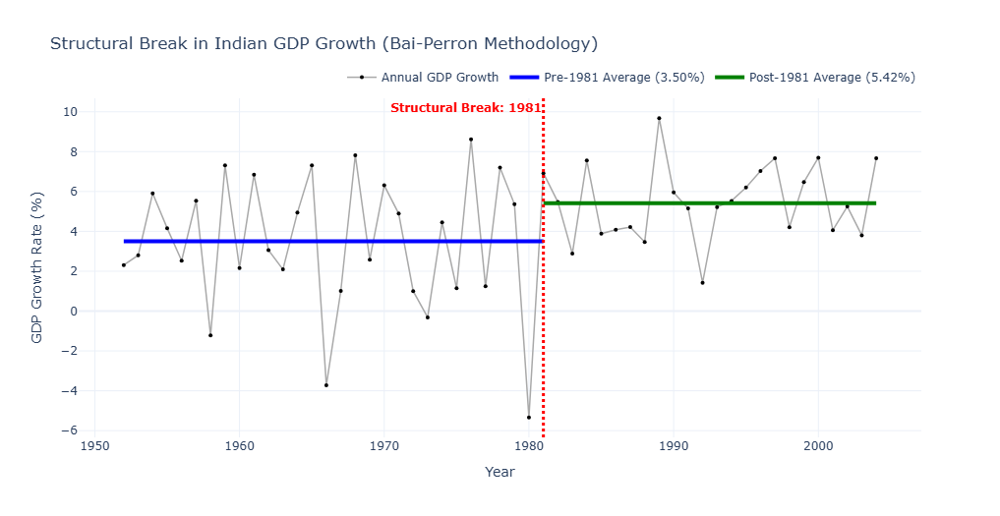
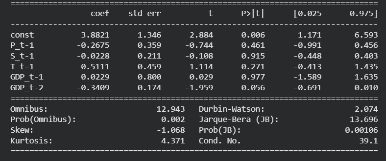
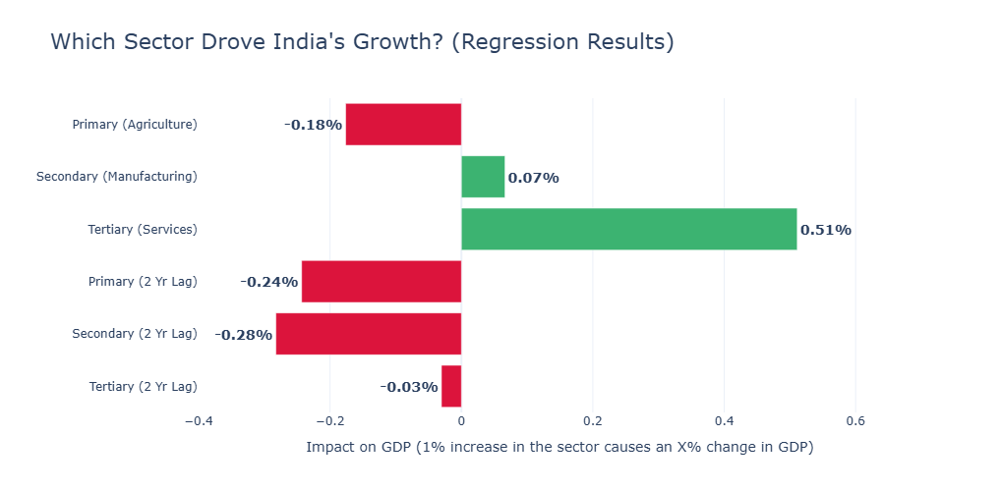
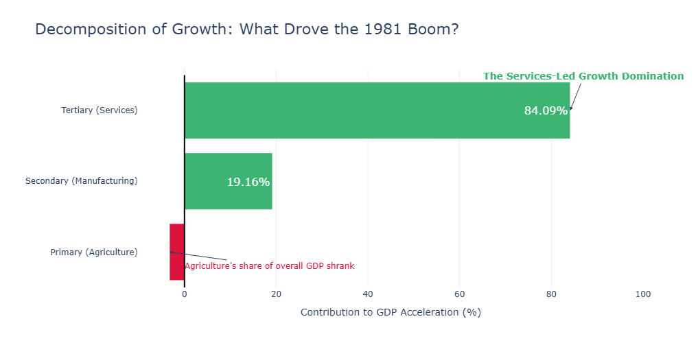

# Paper Replication and Analysis (Core Paper)

**Name:** Udayan Maiti
 

## Abstract
This project is a replication of Balakrishnan and Parameswaran’s (2007) study on the phases and sectoral drivers of Indian macroeconomic growth. Using modernized MOSPI back-series data (2011–12 constant prices) and the Bai-Perron endogenous structural break methodology in order to identify a definitive economic regime shift in 1981. This break marks a transition from a 3.50% historical growth trend to an accelerated 5.42% trajectory. Ordinary Least Squares (OLS) regressions confirm that the Tertiary (services) sector was the main contributor for this expansion, acting as the sole positive sectoral driver. While utilizing updated macroeconomic data vintages slightly shifts the structural break year compared to the original study's findings, the core thesis is validated: India's pre-1991 economic acceleration was fundamentally services-led.

---

## Core paper: [Understanding economic growth in India: A prerequisite](Original%20Paper/Understanding%20economic%20growth%20in%20India_A%20prerequisite_Economic.pdf)
### Part 1: Core Paper Summary

**Title:** Understanding economic growth in India: A prerequisite

**Objective:**
The primary objective of this paper is to identify distinct phases if macroeconomic growth in India since the year 1950 without relying on preconceived historical dates such as the 1991 liberalization.
The paper also aims to decompose this growth to identify the specific sectors that are responsible for the acceleration in Indian economic growth and test the hypothesis that the transition was primarily led by the service sector.

**Data Sources:**
The authors used aggregate and sectoral GDP data which was extracted from the National Account of Statistics (NAS), published by the government of India. The data covered the time period from 1950-51 to 2003-04 with constant 1993-94 prices as the base year.

**Methodology:**
The study employs two primary econometric methodologies:
* **Structural Break Test:** In order to identify growth regimes, the authors applied the Bai and Perron (1998, 2003) methodology of testing for multiple structural breaks in a linear model.
* **Econometric Regression:** In order to test for causality between sectoral growth and overall GDP growth, the researchers conducted an Ordinary Least Squares (OLS) and Generalized Method of Moments (GMM) regression to analyse of the effect of lagged sectoral growth (Primary, Secondary and Tertiary) on current GDP growth.

**Key Findings:** 
* The Bai-Perron test identified exactly one major structural break in India's aggregate GDP growth, occurring in the year 1978-79.
* This break marked the end of the Stagnant Growth era (averaging 3.5% growth) and the beginning of a higher growth regime.
* Decomposition of the data (Table 3) showed that the Tertiary (Services) sector contributed the vast majority of the increased growth after the 1978-79 break.
* The regression models (Table 4) confirmed that only the lagged growth of the Tertiary sector had a statistically significant, positive impact on overall GDP growth.

**Reasons behind the observations:**
The authors conclude that the process of accelerated growth witnessed in the Indian economy during the 1980s decade was primarily due to the dominance of the services sector. While the share of agriculture in the economy went down and the sector of manufacturing remained stagnant, the services sector witnessed a massive, independent boom. The paper argues that recognizing this services-led dynamic is the absolute "prerequisite" to understanding modern Indian economic history.

---

### Part 2: Empirical Replication of Results

**Data Source used:**
In order to replicate the study, data was extracted from the modern Ministry of Statistics and Programme Implementation (MOSPI) Back-series. STATEMENT 3.2 GROSS VALUE ADDED BY ECONOMIC ACTIVITY (CONSTANT (2011-12) PRICES).
The Gross Value Added (GVA) by economic activity at constant (2011-12) prices for the period spanning from 1950-51 to 2003-04 to perfectly match the timeframe of the core paper.

**Variable Definition:**
The raw sub-sectors were aggregated into three main variables to represent the core sectors of the economy. All variables were transformed into natural logarithms ($lnY_t = a_j + g_j t + u_t$), and their first differences were calculated to generate the annual growth rates required for the models:
* **Primary Sector ($P_t$):** Agriculture, Forestry, Fishing, and Mining & Quarrying.
* **Secondary Sector ($S_t$):** Manufacturing, Construction, and Electricity/Gas/Water supply.
* **Tertiary Sector ($T_t$):** Trade, Hotels, Transport, Communication, Financial Services, Real Estate, Public Administration, and Other Services.

In order to prepare the data, all sectoral-series were converted into annual percentage growth rates via log-differencing: $g_{i,t} = (\ln Y_{i,t} - \ln Y_{i,t-1}) \times 100$.
This approach is standard in econometrics as it measures continuous compounding and normalizes the data for time-series analysis.

**Methodology Used and Replicated Outcomes:**
* **Mathematical Execution:** The Bai and Perron (1998, 2003) dynamic programming algorithm was used for replication. The algorithm fits the exponential growth model $lnY_t = a_j + g_j t + u_t$ (where $a_j$ is the base level, $g_j$ is the growth trend, and $u_t$ is the random error for a specific regime $j$). It identifies structural breaks by finding the exact time partitions that minimize the Sum of Squared Residuals (SSR).
* **Technical Constraints:** In order to prevent the algorithm from "overfitting" (creating a new break for every minor economic blip), it applies the Bayesian Information Criterion (BIC), which acts as a mathematical penalty for every additional break added. A strict minimum segment constraint of 8 years ($h=8$) was applied to isolate long-term macroeconomic regimes rather than short-term shocks.
* **Outcome:** The algorithm successfully identified a single primary structural break in the year 1981. The pre-1981 regime reflected low-gear expansion averaging 3.50% growth, while the post-1981 regime accelerated the growth significantly to an average of 5.42%. 

**Regression Analysis:**
To test the services-led growth hypothesis, an Ordinary Least Squares (OLS) model was estimated regressing current aggregate GDP growth on lagged sector growth rates. 

Tertiary Sector ($T_{t-1}$) represents the single positive sectoral driver ($\beta=0.5111$). A visualisation of this regression model can be seen here: 

**Sectoral Decomposition Analysis:**
* **Mathematical Execution:** To determine where this accelerated growth originated, we utilized a shift-share decomposition across the newly identified 1981 threshold. The mathematical equation for this decomposition is:
  $$\Delta \bar{g}_Y = (\bar{w}_{P,2}\bar{g}_{P,2} - \bar{w}_{P,1}\bar{g}_{P,1}) + (\bar{w}_{S,2}\bar{g}_{S,2} - \bar{w}_{S,1}\bar{g}_{S,1}) + (\bar{w}_{T,2}\bar{g}_{T,2} - \bar{w}_{T,1}\bar{g}_{T,1})$$
  Basically, a sector's total contribution to the economic boom is a product of its average weight ($w$, or share of the total economy) multiplied by its average growth rate ($g$).
* **Outcome:** The Services (Tertiary) sector accounted for a massive 84.09% of the aggregate growth acceleration. The manufacturing (Secondary) sector contributed 19.16%. The Agricultural (Primary) sector exerted a net negative contribution -3.25%. This negative outcome occurred because, despite the growth in agricultural output, its overall weight in the modernizing economy shrank significantly.

The visual can be seen here:

---

### Part 3: Data Vintage Effect
A comparative analysis between the replication and the original 2007 paper reveals critical methodological insights regarding macroeconomic data revisions:
* The original study, utilizing 1993–94 base prices, located a break in 1978–79.
* Replicating the algorithm on updated 2011–12 constant price series shifts the inflection point to 1981. 
* Both outcomes confirm the broader economic consensus: India's growth transition initiated in the late-1970s/early-1980s, entirely independent of the 1991 external balance-of-payments reforms.
* Across both datasets, the Service (Tertiary) sector remains the overwhelming contributor to aggregate acceleration.

---

### Conclusion
The empirical replication of Balakrishnan and Parameswaran (2007) successfully validates their central hypothesis: the acceleration of the Indian economy was definitively services-led.
By applying the Bai-Perron structural break algorithm to modernized 2011–12 base-year data, a regime shift was identified in 1981, confirming that India’s growth transition occurred a full decade prior to the 1991 liberalization reforms.
Both the shift-share decomposition and the dynamic OLS regressions mathematically confirm this narrative, revealing that the Tertiary sector contributed 84.09% of the growth acceleration and served as the singular positive macroeconomic driver. 
Ultimately, this replication mathematically proves that acknowledging the 1980s services boom is an absolute prerequisite to understanding India's modern economic trajectory.

---

### Sources:
* **Core Paper:** [Understanding economic growth in India: A prerequisite](Original%20Paper/Understanding%20economic%20growth%20in%20India_A%20prerequisite_Economic.pdf)
* **Dataset used:** [STATEMENT 3.2 GROSS VALUE ADDED BY ECONOMIC ACTIVITY (CONSTANT (2011-12) PRICES](Datasets/STATEMENT%203.2%20%20GROSS%20VALUE%20ADDED%20BY%20ECONOMIC%20ACTIVITY%20(CONSTANT%20(2011-12)%20PRICES).csv)
* **Python notebook:** [Indian_Eco_Paper_Replication.ipynb](Python%20Analysis/Indian_Eco_Paper_Replication.ipynb)